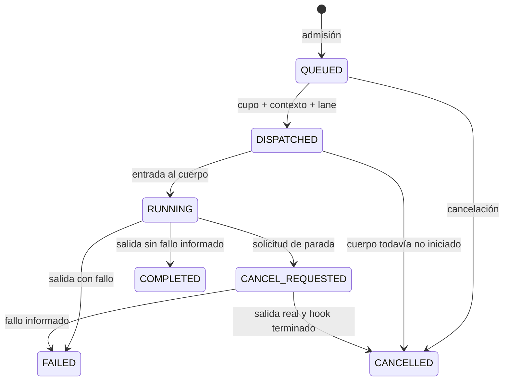

# TaskManager legacy: implementación y entrega

Fecha: 2026-10-02. Cambios locales, sin commit ni despliegue.

Este documento describe el código implementado después de la [revisión y propuesta](TASKMANAGER_PROPUESTA_MEJORA.md). La propuesta conserva la evidencia del código anterior; sus números de línea y sus descripciones de fallos no describen el coordinador nuevo.

## 1. Cómo funciona ahora

1. `LegacyNetworkActionExecutor` prepara todas las instancias, contextos y opciones del plan antes de publicarlo. Si una preparación falla, ningún paso se admite.
2. `TaskManager.submitWorkers` valida instancias nuevas y admite el grupo completo bajo un único lock. Si no cabe, devuelve `TASK_QUEUE_FULL` y no publica ningún paso. Las plazas libres cuentan como ejecución inmediata, incluso con capacidad de espera cero.
3. Cada contexto conserva una cola FIFO. Sólo su cabeza compite por capacidad; un lane ocupado nunca permite adelantar pasos del mismo contexto. Otros contextos elegibles pueden avanzar y reciben turnos entre ejecuciones.
4. El coordinador reserva un cupo global, el contexto y el lane antes de entregar el wrapper al executor. `DISPATCHED` ya consume capacidad. El pool de workers es independiente del scheduler de cron.
5. El wrapper marca `RUNNING` al entrar al cuerpo. Al salir, marca `COMPLETED`, `FAILED` o `CANCELLED`, libera reservas y despierta el despacho inmediatamente. `COMPLETED` significa que el cuerpo terminó sin fallo informado; no certifica el éxito de todos los efectos de negocio.
6. Cancelar un future en ejecución marca `CANCEL_REQUESTED`. Las reservas siguen ocupadas hasta la salida real del cuerpo y de su hook de parada. Cancelar antes de entrar impide ejecutar el cuerpo y permite liberar la reserva.
7. Las consultas leen snapshots sin crear colas. Cada worker tiene `executionId`; los pasos del plan comparten `groupId`. Los resultados terminales se conservan con límite de cantidad y tiempo.
8. Cada disparo de cron prepara workers nuevos. Se omiten disparos mientras el plan cron del mismo contexto siga vivo, incluso después de reemplazar su programación. Quitar un cron no cancela el plan ya admitido.

### Estados

Los fallos de transferencia al executor pueden finalizar en `FAILED` si está cerrado. Un rechazo transitorio conserva la reserva `DISPATCHED`, con motivo `EXECUTOR_UNAVAILABLE`, hasta la reconciliación. No se pierde un plan ya admitido.

## 2. Configuración

Fuente de resolución: [TaskManagerConfig](../src/main/java/org/lareferencia/core/task/TaskManagerConfig.java). Valores de ejemplo actualizados en [05-harvester.properties](../../lareferencia-lrharvester-app/config/application.properties.d/05-harvester.properties) y en el modelo `application.properties.en.model.v4`.

| Propiedad | Default | Alcance |
|---|---:|---|
| `workflow.engine` | legacy | Este coordinador se crea sólo para legacy. |
| `taskmanager.concurrent.tasks` | 4 | Reservas globales activas: DISPATCHED, RUNNING y CANCEL_REQUESTED. Mínimo 1. |
| `taskmanager.max-queued-tasks` | 32 | Workers pendientes agregados, global por instancia. Permite 0. |
| `taskmanager.max_queuded.tasks` | 32 | Alias histórico. Si se definen ambas claves con valores distintos, falla el arranque. |
| `scheduler.pool.size` | 10 | Hilos para cron y tareas del scheduler; no determina la concurrencia de workers. |
| `taskmanager.reconcile.interval-ms` | 2000 | Reintento de transferencias y purga de resultados. Debe ser positivo. |
| `taskmanager.result-retention-seconds` | 3600 | Retención máxima de snapshots terminales. |
| `taskmanager.max-retained-results` | 1000 | Cantidad máxima de snapshots terminales. |
| `taskmanager.shutdown-timeout-seconds` | 30 | Espera del executor durante shutdown, después de solicitar parada. Permite 0. |

`taskmanager.clean.interval` deja de usarse. `taskexecutor.pool.size` corresponde a otro executor y no gobierna este pool. No hay cambio automático en la configuración externa de una instalación; revisar sus valores antes de actualizar.

Lane negativo desactiva la exclusión por lane; lane 0 es un lane normal. El contexto sigue siendo el ID que aporta el worker. No se unificaron los contextos manuales dARK con `NETWORK::<id>` ni se añadieron bloqueos por recursos externos.

## 3. Integraciones y evidencia en código

Rutas core relativas a `src/main/java/org/lareferencia/core/`:

| Garantía / cambio | Fuente |
|---|---|
| Admisión completa, reservas, FIFO, reparto entre contextos | `task/TaskManager.java`: `submitWorkers`, `immediatelyEligible`, `reserveReady` |
| Finalización real y cancelación segura | `task/TaskManager.java`: `runExecution`, `finish`, `cancel`, `clearQueued`, `cancelAllByRunningContextID` |
| Cron nuevo por disparo y exclusión de duplicados | `task/TaskManager.java`: `scheduleWorkers`, `fire`, `clearScheduleByRunningContextID` |
| Límites validados y alias | `task/TaskManagerConfig.java`: `taskManager`, `queuedLimit` |
| Preparación completa y propagación de rechazo | `task/LegacyNetworkActionExecutor.java`: `submitAction`, `submitAllActions`, preparación del plan |
| Resultado de admisión con IDs | `task/TaskSubmission.java`, `task/TaskSubmissionRejectedException.java` |
| Contrato compatible con otros motores | `task/INetworkActionExecutor.java`, `task/NetworkActionkManager.java` |
| Token de cancelación y fallo informado | `worker/BaseWorker.java`; bases de batch e iterador |
| Salida de harvesting, interrupción y cierre del catálogo | `worker/harvesting/HarvestingWorker.java`, `OCLCBasedHarvesterImpl.java` |
| Cancelación de validación sin marcarla completa | `worker/validation/ValidationWorker.java`: `onCancelled` |
| Rollback Solr en el hilo ejecutor antes de liberar reservas | `worker/solr/BaseBatchSolrWorker.java` |

Integraciones en `lareferencia-lrharvester-app`:

- `ApiV5ManagementService`: recibos de admisión con `groupId` real, rechazo de cola como HTTP 503 y rechazo individual en batches. Un HTTP 202 significa admisión, no terminación.
- `ApiV5ManagementController`: `GET /api/v5/runtime/executions` protegido para administradores, con snapshots live y terminales retenidos; sólo hay registros TaskManager en legacy.
- `ActionsController`: rechazo explícito 503 para callers de las acciones legacy.
- `DarkManualCommandRegistry`: usa el estado del coordinador para no declarar terminal una cancelación mientras el cuerpo siga ejecutándose.
- `LegacyNetworkActionExecutor.listRunning`: publica IDs únicos y contexto/grupo/estado; cancelación y consulta por ID de contexto se conservan como fallback legacy.

Las métricas JMX incluyen activos, pendientes, DISPATCHED, CANCEL_REQUESTED, rechazos, cron omitidos y límites efectivos. Los snapshots incluyen fechas y motivo de espera: `CONTEXT_ORDER`, `CONTEXT_BUSY`, `LANE_BUSY`, `GLOBAL_CAPACITY` o `EXECUTOR_UNAVAILABLE`.

## 4. Comprobaciones realizadas y pendientes

- Una ejecución anterior de `TaskManagerTest` terminó con **16 pruebas aprobadas**: FIFO, lanes, reparto, admisión completa, espera cero, reintento, cancelación antes/durante el cuerpo y durante el hook, limpieza de colas, retención, fallos informados, cron y shutdown. Fue anterior a los últimos ajustes de iteradores, validación, filtros de runtime y configuración.
- La compilación del reactor offline de core + app y sus dependencias terminó correctamente. Comando: `mvn -o -pl lareferencia-core-lib,lareferencia-lrharvester-app -am -DskipTests compile`.
- La ejecución ampliada encontró un error de compilación en fixtures nuevos: `Network` no tiene `setId`. Se corrigió usando `ReflectionTestUtils`; esa suite no se volvió a ejecutar. No se considera validada.
- Quedan fixtures de integración de admisión/API, configuración y cooperación del iterador para una ejecución posterior autorizada. No se ejecutaron instalaciones reales, DB/Solr/red, pruebas de carga ni el perfil alternativo completo `lareferencia`.

## 5. Límites y siguientes evaluaciones

- Coordinación local y en memoria: no ofrece persistencia de colas ni exclusión entre JVMs. Un reinicio pierde pendientes y resultados retenidos.
- La cancelación es cooperativa. Un worker que ignore el token/interrupción conserva reservas. El timeout de shutdown acota la espera del executor; no acota un `stop()` personalizado que bloquee al solicitar parada.
- La admisión es atómica; los efectos de negocio no son transaccionales. Un fallo de un paso no cancela automáticamente todos los siguientes: se conserva la política anterior. Evaluar esa política por acción antes de cambiarla.
- Los workers custom que absorben errores deben informar el fallo mediante `BaseWorker.recordExecutionFailure` o lanzar la excepción. No existe un contrato universal de éxito de negocio.
- No hay cuotas por contexto, prioridades, retries automáticos de negocio, recuperación tras reinicio ni scheduling distribuido. Son evoluciones separadas que requieren una necesidad operativa medida.
- Revisar locks de recursos compartidos entre contextos dARK/red, validación y Solr antes de subir el límite de concurrencia. Cambiar un contexto por otro puede cambiar la exclusión existente.
- El API Java `scheduleWorker(worker, cron)` se sustituyó por `scheduleWorkers(contextId, description, factory, cron)`; callers del repo migrados. Cualquier consumidor externo de core-lib deberá usar una fábrica de instancias nuevas.

La revisión de otro agente debería comenzar por la suite ampliada y por escenarios con workers reales que cancelan en I/O, y después evaluar carga/tiempos de espera sin cambiar los límites por intuición.

## 6. Configuración editable desde Admin → Procesos

Ampliación del 2026-10-02: los cinco valores de configuración del coordinador se pueden cambiar desde la página de procesos/runtime del Admin. El panel utiliza el diseño existente, tiene traducciones ES/EN/PT y un botón **Guardar y aplicar**. No cambia los valores mientras se edita. Muestra el origen de configuración y la fecha/usuario de la última modificación.

### Configuraciones editables

- `concurrentTasks`: workers simultáneos; mínimo 1.
- `maxQueuedTasks`: capacidad global de espera; mínimo 0.
- `resultRetentionSeconds`: retención de resultados terminales; mínimo 1 segundo.
- `maxRetainedResults`: máximo de resultados retenidos; mínimo 1.
- `shutdownTimeoutSeconds`: espera del executor durante apagado; mínimo 0 segundos.

Se validan enteros, rangos de representación y duraciones antes de guardar. Las propiedades de pool del scheduler y frecuencia de reconciliación siguen siendo configuración de arranque, fuera del formulario.

### Semántica de cambios en runtime

- El coordinador publica una configuración completa, no setters independientes para cada campo.
- Cambiar concurrencia redimensiona el pool de workers y cambia las reservas permitidas. Aumentarla despierta el despacho de pendientes elegibles.
- Reducir concurrencia conserva todas las reservas existentes, incluidas DISPATCHED y CANCEL_REQUESTED. Pueden superar temporalmente el nuevo límite hasta terminar; no se reservan nuevos workers mientras no haya cupo.
- Reducir cola no elimina tareas ya admitidas. Nuevas admisiones completas se rechazan cuando no caben bajo el nuevo límite.
- Cambiar retención purga resultados terminales que exceden el nuevo límite. No afecta ejecuciones vivas.
- Los lanes, el FIFO y la cancelación cooperativa conservan su semántica.

### Persistencia y arranque

`TaskManagerConfiguration` es una fila de instalación con ID fijo 1. Se guardan los cinco valores, `updatedAt` y `updatedBy`; la migración no inserta una fila inicial. Sin fila, `TaskManagerConfig` toma los valores de properties/defaults. Con fila, los valores guardados tienen prioridad sobre esos cinco properties desde la construcción del bean, antes de admitir trabajo. La frecuencia de reconciliación permanece en properties.

`TaskManagerRuntimeConfigurationService` serializa escrituras de esta JVM y confirma la transacción de DB antes de aplicar el valor al coordinador. Un fallo de commit no cambia los límites vivos. Si el proceso se apaga después del commit y antes de la aplicación, el valor durable se restaura al siguiente arranque. La coordinación sigue siendo local: no se añadió propagación de cambios entre varias JVMs compartiendo DB.

**Migración requerida**: `../../lareferencia-shell/src/main/resources/db/migration/V5.0.0.15__TaskManager_runtime_configuration.sql`. Se utiliza el mecanismo de migración de `lareferencia-shell` existente en el proyecto. No se ha aplicado a una DB ni se ha desplegado esta ampliación. Debe migrarse antes de arrancar la versión nueva del Harvester; el esquema existente no contiene la tabla nueva.

### API y fuentes

- `GET /api/v5/runtime/configuration`: configuración efectiva, `persisted`, `updatedAt` y `updatedBy`.
- `PUT /api/v5/runtime/configuration`: objeto completo con los cinco campos anteriores; responde con el mismo formato que GET.
- Ambos requieren `ROLE_ADMIN`; el cliente utiliza el manejo CSRF ya existente.
- Valores inválidos: 422 `TASKMANAGER_CONFIGURATION_INVALID`; motor diferente de legacy: 409 `TASKMANAGER_CONFIGURATION_UNAVAILABLE`; coordinador en apagado: 503 `TASKMANAGER_SHUTDOWN`.

Código core: `task/TaskManager.java` (`RuntimeConfiguration`, `updateRuntimeConfiguration`), `task/TaskManagerConfig.java`, `task/TaskManagerRuntimeConfigurationService.java`, `domain/TaskManagerConfiguration.java` y `repository/jpa/TaskManagerConfigurationRepository.java`.

Código app: `ApiV5RuntimeConfigurationController.java`. UI: `lareferencia-lrharvester-admin-web/src/features/runtime/TaskManagerConfigurationPanel.tsx`, integrada en `RuntimePage.tsx`, tipos y cliente API, claves de queries y traducciones.

Comprobaciones de esta ampliación: compilación Maven offline del reactor core/app y chequeo TypeScript del Admin. No se añadieron ni ejecutaron pruebas para esta ampliación, ni se comprobó una instalación real/UI en navegador o se migró una DB.

## 7. Visualización de capacidad, lanes y colas

Admin → Runtime incorpora un panel sobrio encima del formulario y de la tabla de procesos, visible con el motor legacy. Usa los endpoints existentes de ejecuciones y configuración; no añade tablas ni requiere otra migración.

- Dos barras muestran activos / concurrencia máxima y pendientes / capacidad global de cola. Activos = DISPATCHED + RUNNING + CANCEL_REQUESTED. Si la ocupación supera un límite reducido, se muestra el exceso con el conteo real y la barra saturada. Una cola de capacidad cero se identifica explícitamente.
- Los lanes no negativos observados en snapshots muestran reserva 0/1 o 1/1, estado, worker/fuente y cantidad de pasos pendientes asignados a ese lane. Esa cantidad incluye esperas por contexto, no sólo bloqueos de lane. Los lanes libres se obtienen de resultados recientes retenidos; el panel no afirma enumerar todos los lanes configurados. Los workers con lane negativo o sin lane se resumen aparte.
- Las colas por contexto se ordenan por cantidad de pendientes. Conservan el orden de admisión que expone el coordinador; muestran el worker activo, los tres primeros pasos pendientes y un botón para expandir el resto. No inventan un máximo individual por contexto. El motivo de espera de la cabeza está visible.
- Refresco cada 10 segundos, traducciones ES/EN/PT, distribución adaptable a pantallas pequeñas y colores discretos con etiquetas textuales. Los errores de refresco conservan los últimos datos e indican que no están actualizados. Los máximos se consultan por separado de las ejecuciones y pueden diferir transitoriamente si coinciden con una actualización de configuración.
- El formulario de configuración acompaña el refresco cuando no se está editando y conserva el borrador durante la edición.

Fuentes UI: `RuntimeQueuePanel.tsx`, `queue-translations.ts` y `RuntimePage.tsx`, bajo `lareferencia-lrharvester-admin-web/src/features/runtime/`. Se añadieron tipos y método cliente para `GET /runtime/executions`.

Comprobación: TypeScript del Admin. No se añadieron ni ejecutaron pruebas, ni se desplegó o comprobó visualmente la UI en una instalación real.
